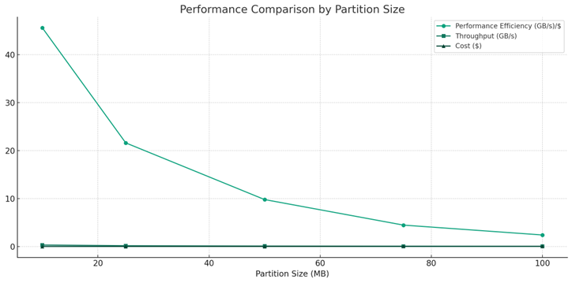

# Cosmic AI: Scalable Infrastructure for Redshift Prediction

**Team 6**  
Pratham Choksi and Dae Hwang

## Problem Statement
Inferring redshift from astronomical images is a computationally demanding task, often constrained by the limitations of local hardware. This project investigates a scalable, cloud-native inference pipeline leveraging AWS Lambda and Step Functions to efficiently predict redshift values across a large dataset. We assess performance in terms of cost, execution time, and throughput across different batch and partition sizes, and compare the results against traditional local CPU-based inference.

## Data Details
- **Source**: `cosmicai-data` (https://drive.google.com/drive/folders/18vX8-6LcGOmRyTbkJwMDOgQY15nGWves)
- **Partitions**: 10MB, 25MB, 50MB, 75MB, 100MB
- **Format**: `.json` files for inference

## Experiment Process
1. **Step Function Setup**: state machine invoking init -> inference -> summarize Lambdas 
2. **Lambda Scripts**: takes a payload and runs batch inference using parallel processing across multiple lambdas
3. **Payload**: Initialize payload

**Example payload:**
```bash
{
“bucket”: “team6-s3-cosmicai-data”,
“file_limit”: ”100”,
“batch_size”: 512,
“object_type”: “folder”,
“S3_object_name”:  “Anomaly Detection”,
“script”: “/tmp/Anomaly Detection/Inference/inference.py”,
“result_path”: “result-partition-50MB/1GB/1”,
“data_bucket”: “cosmicai-data”,
“data_prefix”: “50MB”
}
```
5. **CloudWatch Logs**: Used for monitoring and debugging
6. **Result Storage**: JSON outputs saved in our teams s3 bucket

## Results
### Benchmarks of AWS lambda


- Batch Size Scaling 
Several batch sizes were tested to see how they affect the speed and cost of 
the AWS Lambda inference process. As the batch size increased from 32 to 
512, the total time to complete the task became shorter, and the system was 
able to process more data per second. However, this also led to higher 
memory use, which increased the cost. To better understand the trade-off 
between speed and cost, a new measurement was created called 
performance efficiency. This value looks at how much data can be processed 
for each dollar spent. 
After comparing the results, batch size 256 was chosen for the rest of the 
testing because it provided the best balance between speed and cost. While 
a smaller batch size like 64 gave the highest efficiency in one test, batch size 
256 performed well across different tests and data sizes. It gave fast results 
without being too expensive to run. That’s why it was used as the standard for 
comparing partition sizes and larger datasets in the rest of the project. 

- Partition Size Scaling 
The impact of partition size on performance was tested by keeping the data 
size at 1 GB and using the same batch size of 256. The results showed that 
smaller partition sizes worked better overall, mostly because they allowed 
more Lambda functions to run at the same time. The 10 MB partition 
performed the best, giving the most data processed for each dollar spent, 
thanks to 105 functions running in parallel. As the partition size got larger, up 
to 100 MB, the system didn’t perform as efficiently, even though it could still 
process more data per second. This happened because larger partitions 
reduced the number of requests but increased how long each one took and 
how much memory was needed. Partition sizes around 25 MB seemed to 
offer a good middle ground, with a nice balance between speed and cost for 
medium-sized jobs. 

- Scaling of Larger Data Sizes 
To see how well the system handles bigger jobs, tests were run using larger 
datasets ranging from 1 GB to 12 GB. Two partition sizes were used for this: 
10 MB and 25 MB. The 10 MB partition gave the best overall performance in 
earlier tests, so it was used again here. However, AWS Step Functions have 
a limit of 1,000 parallel Lambda executions per workflow, which means we 
couldn't use 10 MB partitions for the 10 GB and 12 GB test since it would 
require over 1,000 files. For that reason, 25 MB partitions were tested on the 
larger datasets to make sure they could still give good performance while 
staying within system limits. 
With 10 MB partitions, the system scaled very well. As the data size 
increased, the system continued to process data faster. At 4 GB, it reached a 
peak performance efficiency of 67.11 GB per second per dollar, meaning it 
processed a lot of data quickly while using less money. Even at 7.97 GB, 
performance efficiency stayed high, showing that the system handles large 
workloads without slowing down much. Interestingly, the 4 GB test with 10 
MB partitions did not show much increase in execution time compared to 
smaller sizes, which shows that the system can manage growth smoothly. 
The 25 MB partitions also performed well. Though not quite as efficient as the 
10 MB setup, the 4 GB, 6 GB, and 8 GB tests all delivered solid results. The 
system was able to keep up with larger data without much slowdown, and the 
performance efficiency stayed above 21 GB per second per dollar. This 
confirms that 25 MB partitions are a good backup option when smaller ones 
aren’t allowed, and they still give reliable performance at scale. 
Performance efficiency, in this case, is a way to measure how much useful 
work the system does for each dollar spent. It’s like asking, “How much 
processing time can I buy with a small amount of money?” Higher efficiency 
means you’re getting more done at a lower cost, which is especially important 
when working with large datasets and cloud resources. 

### Benchmarks of local computer


- Batch Size Comparison (Local vs AWS Lambda) 
Testing on a local computer helped give a basic idea of how the system 
performs without using cloud services. Different batch sizes were tried using a 
small dataset of 0.1 GB. The best result came from batch size 256, which 
finished the task the fastest, processing about 0.0206 GB of data per second. 
As the batch size got bigger, the time it took went down a little, but the 
change was not very large. 
When larger datasets were used, from 1 GB to 6 GB, the time to finish the job 
increased a lot, while the speed stayed almost the same at around 0.018 GB 
per second. During testing, my laptop could not run the 8 GB dataset due to 
memory limitations, showing that the computer could not keep up as the data 
got too large. 
Overall, these tests show that running jobs on a local computer works fine for 
smaller amounts of data or early testing. But for larger data, it becomes 
slower and less effective. That’s why using cloud systems is more useful 
when working with big datasets.

### Benchmarks of local vs revana (gpu) vs lambda step functions


### Observations
- Cloud-native workflows are scalable, fast, and cost-effective
- Proper tuning (batch, partition, file limits) is key
- Local and GPU testing is useful for development, but AWS is better for scale
- lower partitions performed better
- We found that 256 provided us with the most throughput, but 64 provided us with the best throughput to cost ratio




The results confirmed that serverless is a strong solution for scaling
CosmicAI, with the only major limitation being cloud storage speed.

## Environment Setup
- Clone this repo and update AWS credentials and environment
```bash
  git clone https://github.com/UVA-MLSys/AI-for-Astronomy.git
  
  cd DS5110_Summer_2025/tree/main/Teams/team6
```

### IAM role configurations example


### Lambda Functions
create a lambda function called data-parallel-init with lanbda_function.py code

Set up code to run inference, and connect to Step Function (below)

### Step Functions


---

## Running Inference Locally

```bash
python inference.py
```

- Edit `inference.py` to set local file paths in `sys.path` and `data_dir`.
- Output: `Results.json`, `inference.png`

---

## Running Distributed Inference on AWS

1. Upload dataset and code to your S3 bucket.
2. Update your Step Function payload with:
   - `bucket`, `prefix`, `batch_size`, `world_size`
3. Trigger execution via Lambda or manually in Step Functions console.
4. Monitor CloudWatch logs for performance metrics.
5. Retrieve results from `results/` folder in your S3 bucket.

---

## Folder Structure

```
cosmic-ai-inference/
│
├── inference.py               # Local inference script
├── step-function-payloads/    # Example AWS Lambda payloads
├── scripts/                   # Additional scripts for processing
├── results/                   # Output files
├── requirements.txt
└── README.md
```

---

## References

- [AI-for-Astronomy GitHub](https://github.com/UVA-MLSys/AI-for-Astronomy)
- AWS Lambda, Step Functions, and CloudWatch documentation
